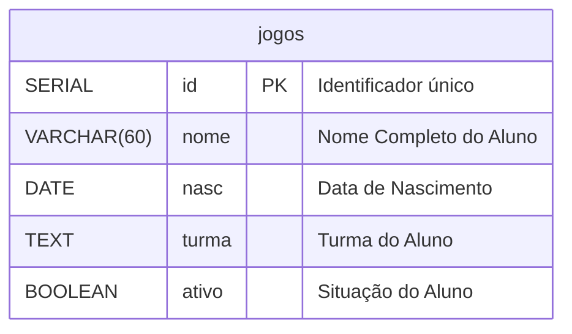

# Documentação do CRUD para Gerenciamento de Escola

## 1. Introdução
Este sistema tem como objetivo gerenciar o cadastro de alunos, permitindo então criar, consultar, atualizar e excluir registros realizados por pessoas autorizadas como funcionários.


## 2. Tecnologias utilizadas
#### 2.1- Linguagem: PHP
#### 2.2- Banco de dados: PostgreSQL
#### 2.3- Front-end: HTML e CSS
#### 2.4- Controle de versão: Git

---

Inicialmente, foi realizado o cadastro do usuário Escola no servidor do MOBA, que será responsável pelo acesso ao sistema.


Após a configuração do usuário, foi criado o banco de dados que será utilizado pelo sistema para armazenar e gerenciar as informações da aplicação.
```sql
CREATE DATABASE 'nome';
```
---

Após a criação do banco de dados, sua propriedade foi transferida do usuário postgres para o usuário Escola, permitindo que este se tornasse o proprietário do banco e passasse a ter as permissões necessárias para o gerenciamento e acesso aos dados da aplicação.
```bash
ALTER DATABASE escola OWNER TO escola;
```


Após a configuração do banco de dados, foi estabelecida a conexão entre o Visual Studio Code e o servidor PostgreSQL, permitindo o acesso ao banco de dados para criação, consulta e gerenciamento.
Portanto criamos uma TABLE chamada "alunos"

```sql
CREATE TABLE alunos(
    id SERIAL PRIMARY KEY NOT NULL,
    nome VARCHAR(60) NOT NULL,
    nasc DATE,
    turma TEXT,
    ativo BOOLEAN
)
```
## Como deve ficar:



